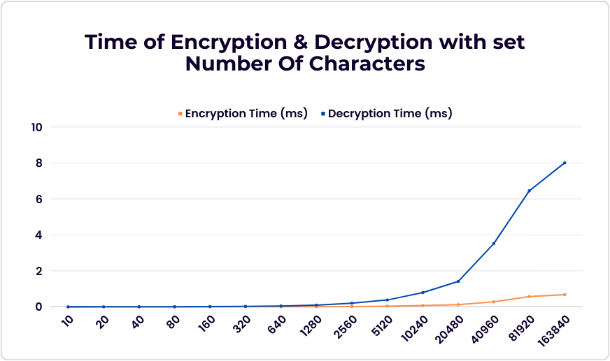

# RSAcrypt

> **Author**: Ľuboslav Motošický | @lubiku35

> **Category**: Cryptography 

> **Subject**: Programming in C/C++

# Table of Contents


# Introduction

Welcome on the RSAcrypt project. This project is a part of the course **Programming in C/C++** at the CTU (Czech Technical University in Prague). The goal of this project is to implement the RSA cryptosystem in C/C++ language.

# Usage

## Download

1. Download [rsacrypt](https://gitlab.fel.cvut.cz/motoslub/rsacrypt/-/blob/main/rsacrypt)

2. Change mode to executable `chmod +x rsacrypt`

3. Run rsacrypt `./rsacrypt`


## CMake

1. Clone repository `git clone https://gitlab.fel.cvut.cz/motoslub/rsacrypt.git`

2. Make build using CMake `cmake -B<build-dir> -H<source-dir>`

3. In your build dir run `make`

4. Run rsacrypt `./rsacrypt`

## Help Menu

```bash
~/tmp$ ./rsacrypt -h
    ____  _____  ___    ______ ____ __  __ ____  ______
   / __ \/ ___/ /   |  / ____// __ \ \/ / / __ \/_  __/
  / /_/ /\__ \/ /| | / /    / /_/ /\  / / /_/ / / /   
 / _, _/___/ // ___ |/ /___ / _, _/ / / / ____/ / /    
/_/ |_|/____//_/  |_|\____//_/ |_| /_/ /_/     /_/     

Welcome to RSAcrypt | RSA Encryption and Decryption program

-e 	[--encrypt] "input"					 Encrypt message
-d 	[--decrypt] "input" <private key D> <modulus N>		 Decrypt message
```

## Encryption

```bash
~/tmp$ ./rsacrypt -e "test"
    ____  _____  ___    ______ ____ __  __ ____  ______
   / __ \/ ___/ /   |  / ____// __ \ \/ / / __ \/_  __/
  / /_/ /\__ \/ /| | / /    / /_/ /\  / / /_/ / / /   
 / _, _/___/ // ___ |/ /___ / _, _/ / / / ____/ / /    
/_/ |_|/____//_/  |_|\____//_/ |_| /_/ /_/     /_/     

Welcome to RSAcrypt | RSA Encryption and Decryption program

Prime candidate P is: 17469205854540742949
Prime candidate Q is: 9417087653910632263
Modulus N is: 164509042776418966870607994274349163587
Phi N is: 164509042776418966843721700765897788376
Public exponent E is: 65537
Message to encrypt is: test
Encrypted message is: 133162842956527207948628029388441397133 121879976640595465600508656357320441280 59303555003801400003767509465107546023 133162842956527207948628029388441397133 
Encryption took: 3.0074e-05ms

Initializing testing decryption...
Private exponent D is: 39166190006263105416216636358855351817
Decrypted message is: test

Decryption took: 0.00026834ms

For decryption of your encrypted message, use the following parameters: 
Encrypted message: 133162842956527207948628029388441397133 121879976640595465600508656357320441280 59303555003801400003767509465107546023 133162842956527207948628029388441397133 
Private exponent D: 39166190006263105416216636358855351817
Modulus N: 164509042776418966870607994274349163587
```

## Decryption

```bash
~/tmp$ ./rsacrypt -d "133162842956527207948628029388441397133 121879976640595465600508656357320441280 59303555003801400003767509465107546023 133162842956527207948628029388441397133" 39166190006263105416216636358855351817 164509042776418966870607994274349163587
    ____  _____  ___    ______ ____ __  __ ____  ______
   / __ \/ ___/ /   |  / ____// __ \ \/ / / __ \/_  __/
  / /_/ /\__ \/ /| | / /    / /_/ /\  / / /_/ / / /   
 / _, _/___/ // ___ |/ /___ / _, _/ / / / ____/ / /    
/_/ |_|/____//_/  |_|\____//_/ |_| /_/ /_/     /_/     

Welcome to RSAcrypt | RSA Encryption and Decryption program

Initializing decryption...
Decrypted message is: test
Decryption took: 0.00118158ms
```

# RSA Cryptosystem

RSA is an asymmetric cryptosystem, which means that it uses two different keys for encryption and decryption. The keys are generated in pairs, one public and one private. The public key is used for encryption and the private key is used for decryption. 

The RSA cryptosystem is based on the difficulty of factorizing large numbers. The security of the cryptosystem is based on the fact that it is very difficult to factorize large numbers.

In the RSA cryptosystem, the public key is represented by the pair `(e, n)` and the private key is represented by the pair `(d, n)`. The public key `(e, n)` is used to encrypt the message and the private key `(d, n)` is used to decrypt the message.


# Project Structure

The project is divided into two main parts: **RSA Encryption** and **RSA Decryption**.

**RSA Encryption** - The RSA Encryption part is used to encrypt a message using the RSA cryptosystem. The RSA Encryption part is implemented in the `RSAEncryptor` class. The `RSAEncryptor` class is a child class of the `RSA` class. The `RSA` class contains the common methods and attributes for the RSA cryptosystem.

**RSA Decryption** - The RSA Decryption part is used to decrypt a message using the RSA cryptosystem. The RSA Decryption part is implemented in the `RSADecryptor` class. The `RSADecryptor` class is a child class of the `RSA` class. The `RSA` class contains the common methods and attributes for the RSA cryptosystem.

**RSA Class** - The `RSA` class contains the common methods and attributes for the RSA cryptosystem. The `RSA` class is a parent class of the `RSAEncryptor` and `RSADecryptor` classes. 

**PrimeCandidate Class** - The `PrimeCandidate` class is used to generate prime numbers.

**Helper Class** - The `Helper` class contains helper methods for the RSA cryptosystem.

**Controller Class** - The `Controller` class is used to control the flow of the program. In the `Controller` class, the user is asked to enter the message to encrypt/decrypt and the public/private key. The `Controller` class is also used to print the results of the RSA cryptosystem and call all the necessary methods.

**Menu Class** - The `Menu` class is used to print the menu of the program. The `Menu` class is used in the `Controller` class.

## Implementation Constants

`MAX_BIT_LENGTH` - maximum bit length of the prime numbers

```cpp
#define MAX_BIT_LENGTH 64
```

`MAX_FIRST_PRIMES` - maximum number until which the prime numbers are generated
```cpp
#define MAX_FIRST_PRIMES 1000
```

`MAX_RABIN_ITERATIONS` - maximum number of iterations for the Rabin-Miller primality test
```cpp
#define MAX_RABIN_ITERATIONS 3500
```

`PUBLIC_EXPONENT_E` - public exponent e
```cpp
#define PUBLIC_EXPONENT_E 65537
```

# RSA Cryptosystem Flow

1. Generate two large prime candidate numbers `p` and `q`.

2. Test if the prime candidate numbers `p` and `q` are low-level prime candidates (divisible by the first n primes).
   
   - If the `p` and `q` are low-level prime candidates, continue to step 3. 
   - If the `p` and `q` are not low-level prime candidates, go back to step 1.

3. Test if the prime candidate numbers `p` and `q` are high-level prime candidates (probable primes using the Rabin-Miller primality test).

    - If the `p` and `q` are high-level prime candidates, continue to step 4. 
    - If the `p` and `q` are not high-level prime candidates, go back to step 1.

4. Calculate the modulus `n` from the prime candidate numbers `p` and `q`. Also known as the public modulus.

5. Calculate the totient of n (`phi(n)`) from the prime candidate numbers `p` and `q`.

6. Calculate the public exponent `e` from the totient of n (`phi(n)`). The key is to select a value that is coprime with the totient (phi(n)). The choice of **65537** is a good compromise between security and efficiency.

8. Encrypt the message `m` using the public key (`e`, `n`). Encrypted message is then `m^e mod n`.

7. Calculate the private exponent `d` from the public exponent `e` and the totient of n (`phi(n)`). Also known as the private exponent.

8. Decrypt the encrypted message `m^e mod n` using the private key (`d`, `n`). Decrypted message is then `m^d mod n`.

# Algorithms & Implementation

In this section, the algorithms used in the project are described. These algorithms serve as a helper functions for the RSA cryptosystem. Also, the implementation of necessary methods are described.

## P and Q Generation

The `Helper` class contains the `generatePrimeCandidate()` method. This method is used to generate a prime candidate number. The prime candidate number is generated using the `std::bitset` where the first and last bit are set to 1 and the rest of the bits are randomly generated. That way, the prime candidate number is always odd and the probability of the prime candidate number being a prime is higher. 

```cpp
std::bitset<MAX_BIT_LENGTH> Helper::generatePrimeCandidate() {
    // Create bitset of size CANDIDATE_SIZE
    std::bitset<MAX_BIT_LENGTH> candidate_bitset;

    // Set the first and last bit to 1
    candidate_bitset.set(0);
    candidate_bitset.set(MAX_BIT_LENGTH - 1);

    // Generate random number
    std::random_device rd;
    std::mt19937 gen(rd());
    std::uniform_int_distribution<> dis(0, 1);

    // Generate random bits
    for (int i = 1; i < MAX_BIT_LENGTH - 1; i++) { candidate_bitset.set(i, dis(gen)); }

    return candidate_bitset;
}
```

The prime candidate number is then converted to the `boost::multiprecision::cpp_int` type. The `boost::multiprecision::cpp_int` type is used to store large integers. In this method the `to_ullong()` method is used to convert the `std::bitset` to the `boost::multiprecision::cpp_int` type.

```cpp
boost::multiprecision::cpp_int Helper::bitsetToCppInt(std::bitset<MAX_BIT_LENGTH> bitset) {
    return bitset.to_ullong();
}
```

## Sieve of Eratosthenes

The Sieve of Eratosthenes is an algorithm for finding all prime numbers up to a specified integer. It is one of the most efficient ways to find small primes. It starts with a list of all numbers from 2 to n. Then it removes all multiples of 2, then all multiples of 3, then all multiples of 5, and so on. The numbers that are left are the prime numbers.

In this project, the Sieve of Eratosthenes is used to generate the prime numbers up to `MAX_FIRST_PRIMES` value. The algorithm is part of `helper` class.


### Example

To find all the prime numbers less than or equal to 30, proceed as follows.

First generate a list of integers from 2 to 30:

```
2 3 4 5 6 7 8 9 10 11 12 13 14 15 16 17 18 19 20 21  22 23 24 25 26 27 28 29 30
```

The first number in the list is 2; cross out every 2nd number in the list after 2 by counting up from 2 in increments of 2 (these will be all the multiples of 2 in the list):

```
2 3  ~4~  5  ~6~  7  ~8~  9  ~10~  11  ~12~  13  ~14~  15  ~16~  17  ~18~  19  ~20~  21  ~22~  23  ~24~  25  ~26~  27  ~28~  29  ~30~ 
```

The next number in the list after 2 is 3; cross out every 3rd number in the list after 3 by counting up from 3 in increments of 3 (these will be all the multiples of 3 in the list):

```
2 3  ~4~  5  ~6~  7  ~8~  ~9~  ~10~  11  ~12~  13  ~14~  ~15~  ~16~  17  ~18~  19  ~20~  ~21~  ~22~  23  ~24~  25  ~26~  ~27~  ~28~  29  ~30~ 
```

The next number not yet crossed out in the list after 3 is 5; cross out every 5th number in the list after 5 by counting up from 5 in increments of 5 (i.e. all the multiples of 5):

```
2 3  ~4~  5  ~6~  7  ~8~  ~9~  ~10~  11  ~12~  13  ~14~  ~15~  ~16~  17  ~18~  19  ~20~  ~21~  ~22~  23  ~24~  ~25~  ~26~  ~27~  ~28~  29  ~30~ 
``` 

The next number not yet crossed out in the list after 5 is 7; the next step would be to cross out every 7th number in the list after 7, but they are all already crossed out at this point, as these numbers (14, 21, 28) are also multiples of smaller primes because 7 × 7 is greater than 30.

The numbers not crossed out at this point in the list are all the prime numbers below 30:

```
 2 3 5 7 11 13 17 19 23 29
```

### Implementation

```cpp
void Helper::sieveOfEratosthenes(Helper &helper, const size_t max_n) {
    // Create a boolean array "prime[0...n]"
    bool prime[max_n + 1];
    // Initialize all entries it as true. A value in prime[i] will finally be false if i is Not a prime, else true.
    memset(prime, true, sizeof(prime));

    // Loop to update prime[]
    for (int p = 2; p * p <= max_n; p++) {
        // If prime[p] is not changed, then it is a prime
        if (prime[p]) {
            for (int i = p * p; i <= max_n; i += p) { prime[i] = false; }
        }
    }

    // Store primes in FIRST_PRIMES vector
    for (int p = 2; p <= max_n; p++) {
        if (prime[p]) { helper.FIRST_PRIMES.emplace_back(p); }
    }
}
```

## Low-Level Prime Test

The low-level prime test is used to check if the prime candidate is divisible by the first n primes. The first n primes are generated using the [Sieve of Eratosthenes algorithm](#sieve-of-eratosthenes). The first n primes are stored in the `FIRST_PRIMES` vector. The first n primes are defined by the `MAX_FIRST_PRIMES` value.

If the prime candidate is perfectly divisible by any of these pre-generated primes, the test fails and a new prime candidate must be picked and tested. This is repeated as long as a value which is coprime to all the primes in our generated primes list is found.

```cpp
bool RSA::isLowLevelPrimeCandidate(Helper &helper, const boost::multiprecision::cpp_int& candidate) {
    // Get first n primes from helper class
    const std::vector<unsigned int> &FIRST_PRIMES = helper.getFirstPrimes();

    // Loop through first n primes
    for (const auto &FIRST_PRIME: FIRST_PRIMES) {
        // Check if prime candidate is divisible by first n primes
        if (candidate % FIRST_PRIME == 0) return false;
    }

    // Additional checks
    if (candidate <= 1 || candidate % 2 == 0 || candidate % 3 == 0 || candidate % 5 == 0) return false;

    return true;
}
```

## High-Level Prime Test (Rabin-Miller Primality Test)

The high-level prime test is used to check if the prime candidate is a probable prime. The Rabin-Miller primality test is used to check if the prime candidate is a probable prime. The Rabin-Miller primality test is a probabilistic algorithm that determines whether a given number is probably prime or definitely composite.

The Rabin-Miller primality test is based on the following theorem:

> Let n be an odd prime number. Then n − 1 is even and we can write n − 1 = 2^k * m, where m is odd. Then for any a coprime to n, either a^m ≡ 1 (mod n) or a^m, a^2m, a^4m, ..., a^(2^(k−1)m) ≡ −1 (mod n).

```cpp
bool RSA::isHighLevelPrimeCandidate(const boost::multiprecision::cpp_int &candidate) {
    boost::multiprecision::cpp_int d = candidate - 1;

    // Find the highest power of 2, k, such that d = 2^k * m
    int k = 0;
    while (d % 2 == 0) {
        d /= 2;
        ++k;
    }
    // Compute m = (n - 1) / 2^k
    boost::multiprecision::cpp_int m = d;

    // Generate random number in range [2, n - 2]
    std::random_device rd;
    std::mt19937 gen(rd());
    std::uniform_int_distribution<unsigned long long> dis(2, static_cast<unsigned long long>(candidate - 2));
    boost::multiprecision::cpp_int a = dis(gen);

    // Compute x = a^m mod n
    boost::multiprecision::cpp_int x = boost::multiprecision::powm(a, m, candidate);

    // Check if x is not 1 and not n - 1
    if (x != 1 && x != candidate - 1) {
        for (boost::multiprecision::cpp_int i = 2; i < MAX_RABIN_ITERATIONS; ++i) {
            x = boost::multiprecision::powm(x, i, candidate);

            if (x == 1) return false; // Composite
            if (x == candidate - 1) return true; // Probable prime
        }

        return false;
    }

    // If x is 1 or n - 1, consider it a probable prime
    return true;
}
```

## Modular Inverse & Extended Euclidean Algorithm

The modular inverse is used to find the modular multiplicative inverse of a number. The modular multiplicative inverse of an integer a modulo m is an integer x such that `a * x` is congruent to 1 modulo m. The modular inverse is used to find the private key from the public key.

The extended Euclidean algorithm is used to find the greatest common divisor of two integers and the coefficients of Bézout's identity. The greatest common divisor of two integers a and b is the largest integer that divides both a and b without leaving a remainder. The extended Euclidean algorithm is used to find the modular inverse.

### Modular Inverse

```cpp
boost::multiprecision::cpp_int RSADecryptor::modInverse() {
    return extendedEuclideanAlgorithm(this->getPublicExponentE(), this->getPhiN());
}
```

### Extended Euclidean Algorithm

```cpp
boost::multiprecision::cpp_int RSADecryptor::extendedEuclideanAlgorithm(boost::multiprecision::cpp_int a, boost::multiprecision::cpp_int m) {
    // Initialize variables for the extended Euclidean algorithm
    boost::multiprecision::cpp_int original_m = m;
    boost::multiprecision::cpp_int quotient, remainder;
    boost::multiprecision::cpp_int x_current = 0, x_previous = 1;

    // Special case: If m is 1, return 0
    if (m == 1)
        return 0;

    // Apply the extended Euclidean algorithm to find the modular inverse
    while (a > 1) {
        // Calculate quotient and remainder in each iteration
        quotient = a / m;
        remainder = a % m;

        // Update a and m for the next iteration
        a = m;
        m = remainder;

        // Update x_current and x_previous
        boost::multiprecision::cpp_int temp = x_current;
        x_current = x_previous - quotient * x_current;
        x_previous = temp;
    }

    // Make x_previous positive
    if (x_previous < 0)
        x_previous += original_m;

    return x_previous;
}
```


# Controller Class

The Controller class serves as the main orchestrator for the RSA encryption and decryption functionality. It handles user input, controls the encryption process, and manages the decryption process. The class encapsulates the logic for parsing command-line arguments, generating prime candidates, computing cryptographic parameters, and orchestrating the encryption and decryption workflows.

## User Input

Handles user input parameters for the encryption and decryption operations. It parses command-line arguments, validates them, and triggers the corresponding encryption or decryption functions.

```cpp
void Controller::handleUserParameters(int argc, char *argv[]) {
    std::vector<std::string> allowed = {"-h", "--help", "-e", "--encrypt", "-d", "--decrypt"};

    // Check if no arguments are provided
    if (argc == 1) {
        std::cerr << "Error: No arguments provided." << std::endl;
        exit(1);
    }


    // Start at 1 to skip the program name
    for (int i = 1; i < argc; i++) {
        std::string arg = argv[i];

        // Check if argument is allowed
        if (std::find(allowed.begin(), allowed.end(), arg) == allowed.end()) {
            std::cerr << "Error: Invalid argument: " << arg << std::endl;
            exit(1);
        }

        if (arg == "-h" || arg == "--help") {
            Menu::printHelpMenu();
            exit(1);
        }
        else if (arg == "-e" || arg == "--encrypt") {
            if (i + 1 < argc) {
                this->controlEncryption(argv[i + 1]);
                exit(1);
            }
            else {
                std::cerr << "Error: -e option requires one argument." << std::endl;
                exit(1);
            }
        }
        else if (arg == "-d" || arg == "--decrypt") {
            if (i + 3 < argc) {
                // Convert private key and modulus N to cpp_int
                try {
                    boost::multiprecision::cpp_int privateKeyD = helper.stringToCppInt(argv[i + 2]);
                    boost::multiprecision::cpp_int modulusN = helper.stringToCppInt(argv[i + 3]);
                    // Decrypt with additional parameters
                    this->controlDecryption(argv[i + 1], privateKeyD, modulusN);
                    i += 3; // Skip the additional parameters
                    exit(1);
                } catch (const std::exception& e) {
                    std::cerr << "\nError: -d option requires three arguments: <string> <private_key> <modulus_N>"
                              << std::endl;
                    exit(1);
                }
            } else {
                std::cerr << "\nError: -d option requires three arguments: <string> <private_key> <modulus_N>"
                          << std::endl;
                exit(1);
            }
        }
    }
}
```

## Encryption Control

Controls the encryption process. It generates prime candidates, computes modulus N, phi N, and public exponent E, encrypts the provided message, and then tests decryption. It provides detailed information about the encryption and decryption processes, including timing information.

```cpp
void Controller::controlEncryption(const std::string& message) {
    // Generate prime numbers
    helper.sieveOfEratosthenes(helper);

    // ======== Generate prime candidates ========
    PrimeCandidate p_candidate = PrimeCandidate();
    PrimeCandidate q_candidate = PrimeCandidate();

    while (true) {
        // Generate prime candidate
        std::bitset<MAX_BIT_LENGTH> p_candidate_bits = helper.generatePrimeCandidate();

        // Convert prime candidate to cpp_int
        p_candidate.setCandidate(helper.bitsetToCppInt(p_candidate_bits));

        // Check if prime candidate is prime
        if (rsa.isLowLevelPrimeCandidate(helper, p_candidate.getCandidate()) && rsa.isHighLevelPrimeCandidate(p_candidate.getCandidate())) {
            std::cout << "Prime candidate P is: " << p_candidate.getCandidate() << std::endl;
            p_candidate.setIsPrime(true);
            break;
        }
    }

    while (true) {
        // Generate prime candidate
        std::bitset<MAX_BIT_LENGTH> q_candidate_bits = helper.generatePrimeCandidate();

        // Convert prime candidate to cpp_int
        q_candidate.setCandidate(helper.bitsetToCppInt(q_candidate_bits));

        // Check if prime candidate is prime
        if (rsa.isLowLevelPrimeCandidate(helper, q_candidate.getCandidate()) && rsa.isHighLevelPrimeCandidate(q_candidate.getCandidate())) {
            std::cout << "Prime candidate Q is: " << q_candidate.getCandidate() << std::endl;
            q_candidate.setIsPrime(true);
            break;
        }
    }


    // Additional check to ensure that P and Q are not equal
    if (p_candidate.getCandidate() == q_candidate.getCandidate()) {
        std::cout << "P and Q are equal, generating new prime candidates..." << std::endl;
        controlEncryption(message);
    }

    // ======== Compute modulus N, phi N and public exponent E ========
    if (p_candidate.getIsPrime() && q_candidate.getIsPrime()) {
        rsa.computeModulusN(p_candidate.getCandidate(), q_candidate.getCandidate());
        rsa.computePhiN(p_candidate.getCandidate(), q_candidate.getCandidate());
        rsa.setPublicExponentE();
    }

    std::cout << "Modulus N is: " << rsa.getModulusN() << std::endl;
    std::cout << "Phi N is: " << rsa.getPhiN() << std::endl;
    std::cout << "Public exponent E is: " << rsa.getPublicExponentE() << std::endl;

    // Encrypt message
    std::cout << "Message to encrypt is: " << message << std::endl;

    // ======== Encryption ========
    RSAEncryptor rsaEncryptor = RSAEncryptor(rsa, message);

    auto e_start = std::chrono::high_resolution_clock::now();
    std::vector<boost::multiprecision::cpp_int> encrypted =  rsaEncryptor.encryptMessage();
    auto e_end = std::chrono::high_resolution_clock::now();

    std::cout << "Encrypted message is: ";
    for (auto & i : encrypted) std::cout << i << " ";
    std::cout << std::endl;

    std::cout << "Encryption took: " << to_ms(e_end - e_start).count() << "ms" << std::endl;

    std::cout << std::endl;

    // ======== Decryption ========
    std::cout << "Initializing testing decryption..." << std::endl;

    // Decrypt message - compute private exponent D
    RSADecryptor rsaDecryptor = RSADecryptor(rsa);

    // Compute private exponent D
    rsaDecryptor.findPrivateKeyD();

    std::cout << "Private exponent D is: " << rsaDecryptor.getPrivateKeyD() << std::endl;

    auto d_start = std::chrono::high_resolution_clock::now();
    // Decrypt message
    std::string decrypted = rsaDecryptor.decryptMessage(encrypted);
    auto d_end = std::chrono::high_resolution_clock::now();

    std::cout << "Decrypted message is: " << decrypted << std::endl;
    std::cout << std::endl;

    std::cout << "Decryption took: " << to_ms(d_end - d_start).count() << "ms" << std::endl;

    // ======== Outro ========
    std::cout << std::endl;
    std::cout << "For decryption of your encrypted message, use the following parameters: " << std::endl;
    std::cout << "Encrypted message: ";
    for (auto & i : encrypted) std::cout << i << " ";
    std::cout << std::endl;
    std::cout << "Private exponent D: " << rsaDecryptor.getPrivateKeyD() << std::endl;
    std::cout << "Modulus N: " << rsa.getModulusN() << std::endl;
    std::cout << std::endl;
}
```

## Decryption Control

Controls the decryption process. It takes an encrypted message, private key (D), and modulus (N) as input and decrypts the message. It provides detailed information about the decryption process, including timing information.

```cpp
void Controller::controlDecryption(const std::string &message, const boost::multiprecision::cpp_int &privateKeyD,
                                   const boost::multiprecision::cpp_int &modulusN) {
    std::cout << "Initializing decryption..." << std::endl;

    auto d_start = std::chrono::high_resolution_clock::now();
    std::string decrypted = RSADecryptor::decryptMessage(message, privateKeyD, modulusN);
    auto d_end = std::chrono::high_resolution_clock::now();

    std::cout << "Decrypted message is: " << decrypted << std::endl;

    std::cout << "Decryption took: " << to_ms(d_end - d_start).count() << "ms" << std::endl;

    std::cout << std::endl;
}
```

# Comparsion of RSA Encryption & Decryption

In this section, the comparsion of RSA encryption and decryption is described. The comparsion is based on the number of characters in the message.

| **Number of Characters** | **Encryption Time (ms)** | **Decryption Time (ms)** |
| -------------------- | -------------------- | -------------------- |
| 10                   | 0.000076496          | 0.000778829          |
| 20                   | 0.000138502          | 0.00147981           |
| 40                   | 0.000303184          | 0.0033099            |
| 80                   | 0.000552601          | 0.00616675           |
| 160                  | 0.00112358           | 0.0130836            |
| 320                  | 0.00218422           | 0.0253329            |
| 640                  | 0.00391407           | 0.0455476            |
| 1280                 | 0.00846359           | 0.0978233            |
| 2560                 | 0.0172043            | 0.204616             |
| 5120                 | 0.0326845            | 0.379809             |
| 10240                | 0.0723438            | 0.791399             |
| 20480                | 0.122942             | 1.41528              |
| 40960                | 0.281566             | 3.51814              |
| 81920                | 0.572155             | 6.44919              |
| 163840               | 0.677419             | 8.01055              |

## Graph Version



# Conclusion

In this project, the RSA cryptosystem was implemented in C/C++ language. The RSA cryptosystem is an asymmetric cryptosystem, which means that it uses two different keys for encryption and decryption. The keys are generated in pairs, one public and one private. The public key is used for encryption and the private key is used for decryption.

We can see that the encryption and decryption time is increasing with the number of characters in the message. The encryption and decryption time is also dependent on the size of the prime numbers. The larger the prime numbers, the longer the encryption and decryption time.

# References

[Wikipedia - RSA_cryptosystem](https://en.wikipedia.org/wiki/RSA_(cryptosystem))

[GeeksForGeeks - RSA Algorithm in Cryptography
](https://www.geeksforgeeks.org/rsa-algorithm-cryptography/)

[GeeksForGeeks - How to generate Large Prime numbers for RSA Algorithm
](https://www.geeksforgeeks.org/how-to-generate-large-prime-numbers-for-rsa-algorithm/)

[Brilliant - RSA Encryption](https://brilliant.org/wiki/rsa-encryption/)

[GeeksForGeeks - Sieve of Eratosthenes](https://www.geeksforgeeks.org/sieve-of-eratosthenes/)

[YouTube - Prime Numbers & RSA Encryption Algorithm - Computerphile](https://www.youtube.com/watch?v=JD72Ry60eP4&t=637s&ab_channel=Computerphile)

[Wikipedia - Modular exponentiation](https://en.wikipedia.org/wiki/Modular_exponentiation)

[Wikipedia - Modular arithmetic](https://en.wikipedia.org/wiki/Modular_arithmetic)
